## 01_Craete public/index.html
```html
<!DOCTYPE html>
<html lang="en">
<head>
  <meta charset="UTF-8">
  <title>Document</title>
</head>
<body>
 
</body>
</html>
```

## 02_Add react links in index.html
```htm
<script src="https://unpkg.com/react@15/dist/react.js"></script>
 <script src="https://unpkg.com/react-dom@15/dist/react-dom.js"></script>
 <script src="/public/scripts/app.js"></script> 
 ```

 ## 03_create scripts/app.js
 ```js
 console.log('App.js is running');
 ```
 ## 04_test if react is installed
 

 ## 05_test if app.js is running

 

## 06_See how babel convert JSX syntax to javascript
```js
 var template = <p>This is JSX from app.js</p>; 
 ```
> * the above code is JSX syntax. html equal to variable template.

> Bable will convert this to javascript syntax
 
 
 

 > React is intended to be used like `var template = <p>This is JSX from app.js</p>;` not compile javascript. So we will installal bable localy.

> Before install bable let us use compiled javascript to our react app

index.html
```html
<!DOCTYPE html>
<html lang="en">
<head>
  <meta charset="UTF-8">
  <title>Document</title>
</head>
<body>
  <div id="app"></div>
 <script src="https://unpkg.com/react@15/dist/react.js"></script>
 <script src="https://unpkg.com/react-dom@15/dist/react-dom.js"></script>
 <script src="/public/scripts/app.js"></script>
</body>
</html>
```
app.js
```js
// var template = <p>This is JSX from app.js</p>;
var template = React.createElement(
  'div',
  { id: 'app' },
  'This is JSX from app.js'
);

var appRoot = document.getElementById('app')
ReactDOM.render(template, appRoot);
```
 

## 07_Install Babel
### 07_1 Install babel
```
yarn global add babel-cli@6.24.1
```
> To check if babel is installed properly
```
babel --help
```
### 07_2 Install babel presets
```
Derejes-MBP:indecision-app derejekitaw$ yarn init
yarn init v1.5.1
question name (indecision-app): react-app
question version (1.0.0):
question description: React training
question entry point (index.js):
question repository url (https://github.com/DerejeKitaw/reactLesson.git):
question author (Dereje Kitaw <dereje.kitaw@gmail.com>):
question license (MIT):
question private: n
success Saved package.json
✨  Done in 63.15s.
Derejes-MBP:indecision-app derejekitaw$
```
> package.json will be generated
```json
{
  "name": "react-app",
  "version": "1.0.0",
  "description": "React training",
  "main": "index.js",
  "repository": "https://github.com/DerejeKitaw/reactLesson.git",
  "author": "Dereje Kitaw <dereje.kitaw@gmail.com>",
  "license": "MIT",
  "private": false
}
```
```
yarn add babel-preset-react@6.24.1 babel-preset-env@1.5.2
```
> package.json will be updated 
```json
{
  "dependencies": {
    "babel-preset-env": "1.5.2",
    "babel-preset-react": "6.24.1"
  }
}
```
## 07_Create `src` folder to put all react codes
create `src/app.js` and move `scripts/app.js` code to `src/app.js`

src/app.js
```js
var template = <p>This is JSX from app.js</p>;

var appRoot = document.getElementById('app')
ReactDOM.render(template, appRoot);
```

## 08_compile using babel
```
babel src/app.js --out-file=public/scripts/app.js --presets=env,react --watch
```
> This will generate `public/scripts/app.js`
```js
'use strict';

var template = React.createElement(
  'p',
  null,
  'This is JSX from app.js'
);

var appRoot = document.getElementById('app');
ReactDOM.render(template, appRoot);
```
## 08_run app
 

## 09_Create .gitignore file
```
node_modules
```

## 10_install extensions
```
> Babel ES6/ES7 - Adds JS Babel es6/es7 syntax coloring.

> Path Intellisense - Visual Studio Code plugin that autocompletes filenames.
```

## 11_Lets add more tags
app.js
```js
var template = <div>This is JSX from app.js!</div><p>paragraph</p>;

var appRoot = document.getElementById('app')
ReactDOM.render(template, appRoot);
```
> will throw error because all html tags should be inclose by one root tag to be compiled by bable
```js
var template =
  <div>
    <div>This is JSX from app.js!</div>
    <p>paragraph</p>
  </div>;

var appRoot = document.getElementById('app')
ReactDOM.render(template, appRoot);
```
 
## 11_For clarity only we will add parenthesis to template variable
```js
var template =(
  <div>
    <div>This is JSX from app.js!</div>
    <p>paragraph</p>
  </div>);

var appRoot = document.getElementById('app')
ReactDOM.render(template, appRoot);
```
## 12_How to use javascript expression
app.js
```js
var name = 'Dereje';
var age = 40;
var template = (
  <div>
    <div>Name: {name}</div>
    <div>Age: {age}</div>
  </div>);

var appRoot = document.getElementById('app')
ReactDOM.render(template, appRoot);
```
 

## 13_variable from object
```js
var use = {
  name : 'Dereje',
  age  : 40
}
var template = (
  <div>
    <div>Name: {use.name}</div>
    <div>Age: {use.age}</div>
  </div>);

var appRoot = document.getElementById('app')
ReactDOM.render(template, appRoot);
```
## 14_Create app with 
> title/subtitle
app.js
```js
var app = {
  title : 'ToDo App',
  subtitle  : 'ToDo app help to organize your works'
}
var template = (
  <div>
    <h1>Title: {app.title}</h1>
    <h3>{app.subtitle}</h3>
  </div>);

var appRoot = document.getElementById('app')
ReactDOM.render(template, appRoot);
```
## 14_How if statement works
```js
var app = {
  title : 'ToDo App',
  subtitle  : 'ToDo app help to organize your works'
}
function getSubtitle(subtitle) {
  if (subtitle) {
    return subtitle;
  } else {
    return 'Please define subtitle'
  }
}
var template = (
  <div>
    <h1>Title: {app.title}</h1>
    <h3>{getSubtitle(app.subtitle)}</h3>
  </div>);

var appRoot = document.getElementById('app')
ReactDOM.render(template, appRoot);
```
 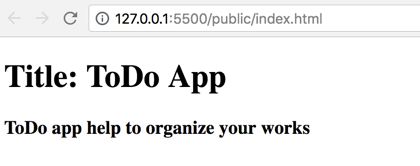

 ```js
 var app = {
  title : 'ToDo App',
  // subtitle  : 'ToDo app help to organize your works'
}
function getSubtitle(subtitle) {
  if (subtitle) {
    return subtitle;
  } else {
    return 'Please define subtitle'
  }
}
var template = (
  <div>
    <h1>Title: {app.title}</h1>
    <h3>{getSubtitle(app.subtitle)}</h3>
  </div>);

var appRoot = document.getElementById('app')
ReactDOM.render(template, appRoot);
```
 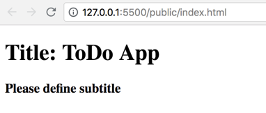

## 14_What javascript expression can do?

> can add JSX expressin inside javascript expression
```js
var app = {
  title : 'ToDo App',
  // subtitle  : 'ToDo app help to organize your works'
}
function getSubtitle(subtitle) {
  if (subtitle) {
    return subtitle;
  } else {
    return 'Please define subtitle'
  }
}
var template = (
  <div>
    <h1>Title: {app.title}</h1>
    <h3>{getSubtitle(app.subtitle)}</h3>
    {324}
    {<h1>inside javascript expression</h1>}
  </div>);

var appRoot = document.getElementById('app')
ReactDOM.render(template, appRoot);
```
 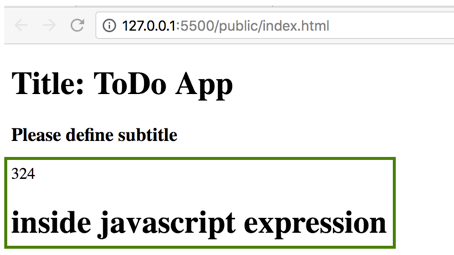

## 14_What javascript expression can do?

> What will happen if javascript expression not defined
```js
var app = {
  title : 'ToDo App',
  // subtitle  : 'ToDo app help to organize your works'
}
function getSubtitle(subtitle) {
  if (subtitle) {
    return subtitle;
  } 
}
var template = (
  <div>
    <h1>Title: {app.title}</h1>
    <h3>{getSubtitle(app.subtitle)}</h3>
    {324}
    {<h1>inside javascript expression</h1>}
  </div>);

var appRoot = document.getElementById('app')
ReactDOM.render(template, appRoot);
```
Here `app.subtitle` is not defined. So it will not be displayed and also removed from the dome.
 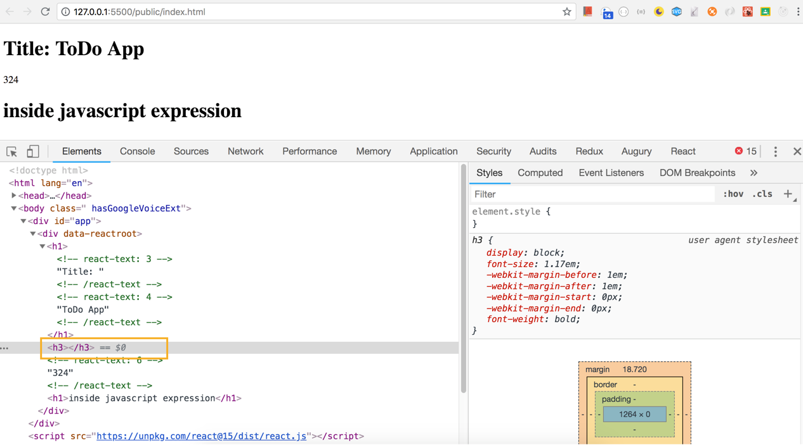
## 15_If javascript expression return undefined element will not be rendered in DOM
```js
var app = {
  title : 'ToDo App',
  // subtitle  : 'ToDo app help to organize your works'
}
function getSubtitle(subtitle) {
  if (subtitle) {
    return <h3>ToDo app help to organize your works</h3>;
  } 
}
var template = (
  <div>
    <h1>Title: {app.title}</h1>
    {getSubtitle(app.subtitle)}
  </div>);

var appRoot = document.getElementById('app')
ReactDOM.render(template, appRoot);
```
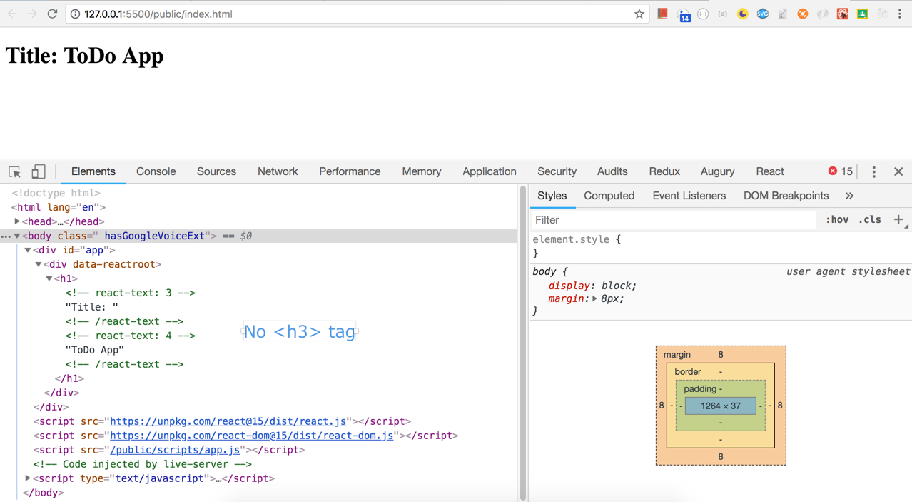
```js
var app = {
  title : 'ToDo App',
  subtitle  : 'ToDo app help to organize your works'
}
function getSubtitle(subtitle) {
  if (subtitle) {
    return <h3>ToDo app help to organize your works</h3>;
  } 
}
var template = (
  <div>
    <h1>Title: {app.title}</h1>
    {getSubtitle(app.subtitle)}
  </div>);

var appRoot = document.getElementById('app')
ReactDOM.render(template, appRoot);
```
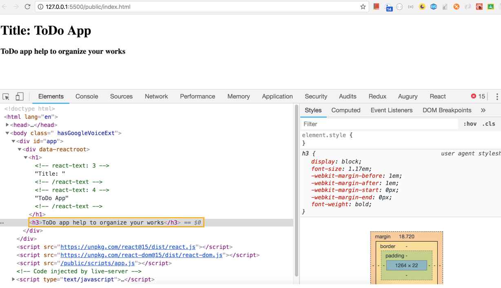
## 16_Ternary operators
```html
<h1>Title: {app.title ? app.title : 'Anonymous'}</h1>
```
> If `app.title` defined it will display `app.title` else `Anonymous`.
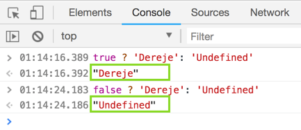

## 17_and operator
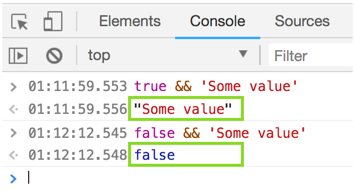
> So
```js
// If age is greater or equal to 18 display age
{app.age >= 18 && <p>Age: {app.age}</p>}
// If age exist and is greater or equal to 18 display age
{app.age  && app.age >= 18 && <p>Age: {app.age}</p>}
```
## _Arrays of strings
```js
var app = {
  title : 'ToDo App',
  subtitle: 'ToDo app help to organize your works',
  age: 10,
  hobbies: ['sports','programing','play with kids']
}
function getSubtitle(subtitle) {
  if (subtitle) {
    return <h3>ToDo app help to organize your works</h3>;
  } 
}
// If there is no hobbies display No hobbies found.
var template = (
  <div>
    <h1>Title: {app.title ? app.title : 'Anonymous'}</h1>
    {getSubtitle(app.subtitle)}
    {app.age >= 18 && <p>Age: {app.age}</p>}
    <div>Hobbies: {app.hobbies.length > 0? `you have ${app.hobbies.length} hobbies`:'No hobbies found.'}</div>
  </div>);

var appRoot = document.getElementById('app')
ReactDOM.render(template, appRoot);
```
## _How to see JSX values
```js
let count = 0;
var template = (
  <div>
    <h1>Counter: {count}</h1>
    <button id='my-id' className='button'>+1</button>
  </div>);

console.log(template);
var appRoot = document.getElementById('app')
ReactDOM.render(template, appRoot);
```
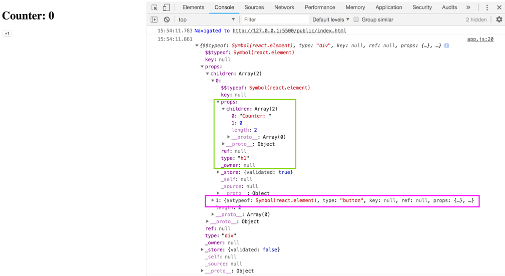
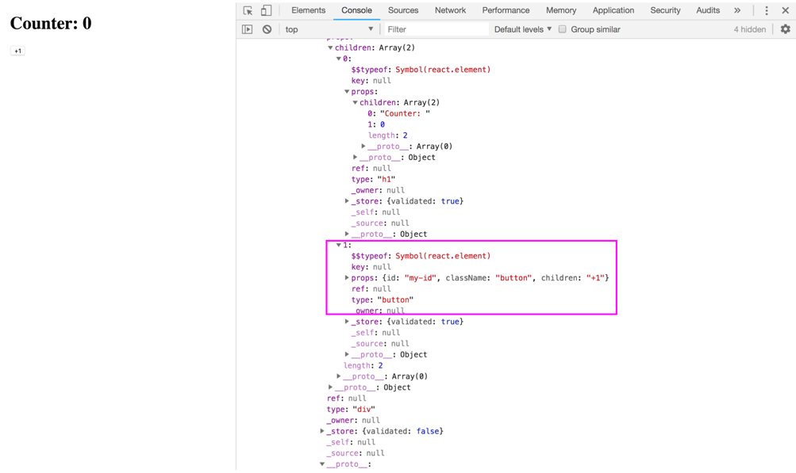

> [All react supported HTML elements](https://reactjs.org/docs/dom-elements.html)

## _How to setup attribute values
```js
const idValue = 'my_id';
var template = (
  <div>
    <h1>Counter</h1>
    <button id={idValue} className='button'>+1</button>
  </div>);
console.log(template);
var appRoot = document.getElementById('app')
ReactDOM.render(template, appRoot);
```

## _How to pass events
```js
let count = 0;

const addOne = () => {
  console.log('addOne');
};

const template = (
  <div>
    <h1>Count:{count}</h1>
    <button onClick={addOne}>+1</button>
  </div>);

const appRoot = document.getElementById('app')
ReactDOM.render(template, appRoot);
```
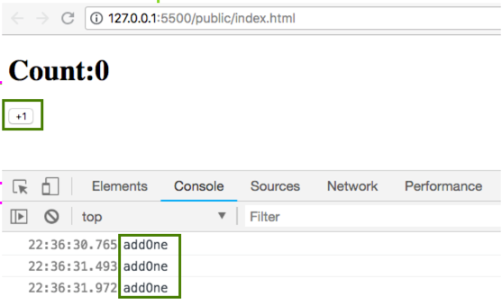

## _Manual data binding
```js
let count = 0;

const minusOne = () => {
  count--;
  console.log('minusOne ' + count);
};
const addOne = () => {
  count++;
  console.log('addOne ' + count);
};
const reset = () => {
  count = 0;
  console.log('reset ' + count);
};

const template = (
  <div>
    <h1>Count:{count}</h1>
    <button onClick={addOne}>+1</button>
    <button onClick={minusOne}>-1</button>
    <button onClick={reset}>Reset</button>
  </div>);

const appRoot = document.getElementById('app')
ReactDOM.render(template, appRoot);
```
> Data is updating but JSX is not rendering the update.
> So re-render we need to put our templae inside a function
```js
let count = 0;

const minusOne = () => {
  count--;
  renderCounterApp();
};
const addOne = () => {
  count++;
  renderCounterApp();
};
const reset = () => {
  count = 0;
  renderCounterApp();
};

const appRoot = document.getElementById('app');

const renderCounterApp = () => {
  const template = (
    <div>
      <h1>Count:{count}</h1>
      <button onClick={addOne}>+1</button>
      <button onClick={minusOne}>-1</button>
      <button onClick={reset}>Reset</button>
    </div>
  );
  ReactDOM.render(template, appRoot);
};
renderCounterApp();
```

## _Forms and input field

[All react dome events](https://reactjs.org/docs/events.html)

